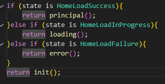

# codigo y explicaion

se retorna la vista de bienvenida sin al momento de entrar, se hace una condicion donde si el estado es success va a retornar la vista principal la vista que todo salio correcto, si el estado es HomeLoadProgress va a retornar la vista de cargando y si el estado es Failure va a retornar la vista de error
